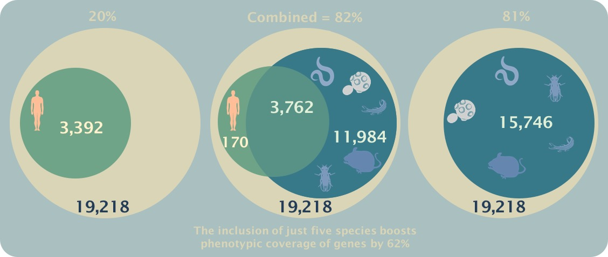

<h2 class="page-title">The Monarch Initiative</h2>

The Monarch Initiative is an integrative data and analytic platform connecting phenotypes to genotypes across 
species, bridging basic and applied research with semantics-based analysis. The correlation of phenotypic outcomes 
and disease with genetic variation and environmental factors is a core pursuit in biology and biomedicine.

 

    

        <h5 class="figure-title">The phenotype annotation coverage of human coding genes.</h4>
        <figure class="cross-species">
          
          <figcaption>
           Fig 1. This figure shows the availability of curated phenotypes that have been attributed to human genes 
           (directly or inferred via orthology) across a range of model organisms (teal circle). Phenotypes for human 
           genes curated in humans are shown in green, and they only represent 20% of the total number of protein-coding 
           genes in the human genome (HGNC, 07-2019). Data from more species raises the phenotypic coverage of human 
           coding genes to 82%.
          </figcaption>
        </figure>
    

    

         <h5 class="figure-title">Cross specific phenotype comparison.</h5>
         <figure>
          
          <figcaption>
           Fig 2. Comparison of PAX6 abnormal phenotypes in human and model organism eyes. 
           (Image from <a href="http://www.plosbiology.org/article/info%3Adoi%2F10.1371%2Fjournal.pbio.1000247" target="__blank">Washington et al, 2009</a>
          </figcaption>
        </figure>
    

  

We have created or currently contribute to many essential bio-ontologies that together enable sophisticated and 
semantically integrated computational analysis across gene, genotype, variant, disease, and phenotype data. We lead 
the development of the <a href="https://hpo.jax.org/">Human Phenotype Ontology</a>, which is used across the world for genomic 
diagnostics in genetic disease and other areas. We have created <a href="http://obofoundry.org/ontology/mondo.html" target="__blank">MONDO</a>, a unified disease ontology 
that represents the most comprehensive integration of disease entities ever achieved. We are a Driver Project for the 
<a href="https://www.ga4gh.org/" target="__blank">Global Alliance for Genomics and Health</a> (GA4GH), and are major contributors to the 
development of genomics standards within GA4GH. We have developed algorithms and tools that are in use by multiple 
communities for tasks including the identification of animal models of human disease through phenotypic similarity, 
phenotype-driven computational support for differential diagnostics, and translational research.

    <h4 class="title">
        Checkout some of our tools and resources below!
    </h4>
    <b-card-group>
        <b-card title="Phenotype Profile Search" class="col-lg-4">
            <b-card-text>
              Targeted search based off a list of phenotypes. 
            </b-card-text>
            <router-link to="/about/monarch-api">
                <b-button class="card-btn">Search <i class="fa fa-caret-right"></b-button>
            </router-link>
          </b-card>
          <b-card title="Monarch API" class="col-lg-4">
              <b-card-text>
                Developer friendly API's for open source data.
              </b-card-text>
              <router-link to="/about/monarch-api">
                <b-button class="card-btn">Learn More <i class="fa fa-caret-right"></b-button>
              </router-link>
          </b-card>
          <b-card title="PhenoPackets" class="col-lg-4">
            <b-card-text>
              A standard to communicate bioinformation. 
            </b-card-text>
            <router-link to="/about/monarch-api">
              <b-button class="card-btn">Explore <i class="fa fa-caret-right"></b-button>
            </router-link>
          </b-card>
    </b-card-group deck>

