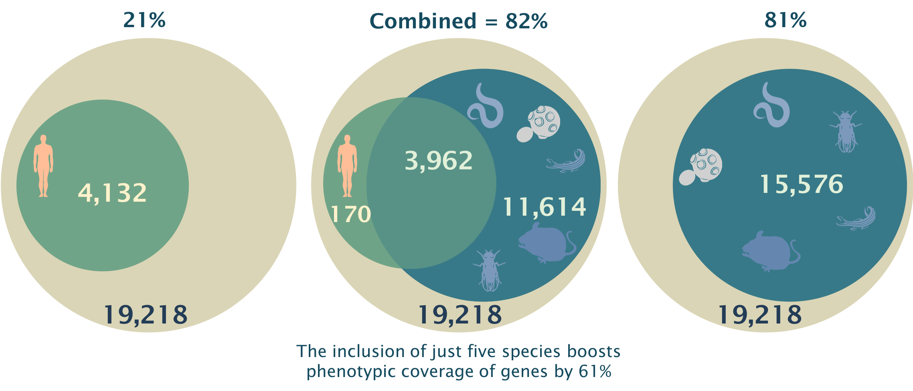
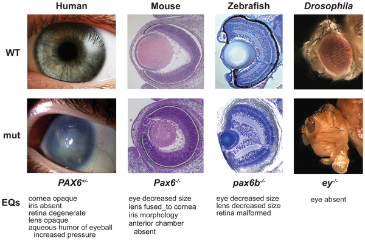

  <h2 class="page-title">The Monarch Initiative</h2>
  

    

      The Monarch Initiative is an integrative data and analytic platform
      connecting phenotypes to genotypes across species, bridging basic and
      applied research with semantics-based analysis. The correlation of
      phenotypic outcomes and disease with genetic variation and environmental
      factors is a core pursuit in biology and biomedicine. We have created or
      currently contribute to many essential bio-ontologies that together enable
      sophisticated and semantically integrated computational analysis across
      gene, genotype, variant, disease, and phenotype data. We have developed
      algorithms and tools that are in use by multiple communities for tasks
      including the identification of animal models of human disease through
      phenotypic similarity, phenotype-driven computational support for
      differential diagnostics, and translational research.
    

  

  

    

      <figure class="cross-species">
        
        <figcaption class="phenotype-coverage">
          Fig 1. Model organisms provide key insight into phenotypic
          manifestations of human coding genes. Human coding genes with
          disease/phenotype-causing mutations are shown on the left; model
          organism orthologs of human coding genes with associated phenotypes
          are on the right. By including just 5 species, we can boost coverage
          by 61%, up to ~82% of human protein coding genes reported by the HUGO
          Gene Nomenclature Committee (HGNC). There are 33 sources of data
          integrated within the Monarch Initiative.
        </figcaption>
      </figure>
    

    

      <figure class="comparison">
        
        <figcaption>
          Fig 2. Comparison of PAX6 abnormal phenotypes in human and model
          organism eyes. (Image from
          <a
            href="http://www.plosbiology.org/article/info%3Adoi%2F10.1371%2Fjournal.pbio.1000247"
            target="__blank"
            >Washington et al, 2009)</a
          >
        </figcaption>
      </figure>
    

  

  

    <h3 id="our-goals"><strong>Monarch's Vision</strong></h3>
    

      

        Integrate, align, and re-distribute cross-species gene, genotype,
        variant, disease, and phenotype data
      

      
Provide a portal for exploration of phenotype-based similarity

      

        Facilitate identification of animal models of human disease through
        phenotypic similarity
      

      
Enable quantitative comparison of cross-species phenotypes

      
Develop embeddable widgets for data exploration

      
Influence genotype and phenotype reporting standards

      
Improve ontologies to better curate genotype-phenotype data

    

  

    
  

    We lead the development of the
    <a href="https://hpo.jax.org/">Human Phenotype Ontology</a>, which is used
    across the world for genomic diagnostics in genetic disease and other areas.
    We are a Driver Project for the
    <a href="https://www.ga4gh.org/" target="__blank"
      >Global Alliance for Genomics and Health</a
    >
    (GA4GH), and are major contributors to the development of genomics standards
    within GA4GH. Additionally, we have developed
    <a href="http://obofoundry.org/ontology/mondo.html" target="__blank"
      >Mondo</a
    >, a unified disease ontology that represents the most comprehensive
    integration of disease entities ever achieved.
  

  

    

      <figure class="ecosystems">
        
        <figcaption>
          Fig 3. The
          <a href="https://hpo.jax.org" target="__blank"
            >Human Phenotype Ontology</a
          >
          (HPO) provides a standardized vocabulary of phenotypic abnormalities
          encountered in human disease.
          <a href="https://pubmed.ncbi.nlm.nih.gov/30476213/" target="__blank"
            >More about HPO...</a
          >
        </figcaption>
      </figure>
    

    

      <figure class="ecosystems phenopackets">
        
        <figcaption>
          Fig 4.
          <a href="http://phenopackets.org/" target="__blank">Phenopackets</a>
          is a standard exchange format for phenotypes and environmental
          factors. This packet of phenotype data can be used anywhere, and can
          be written by anyone. This work is being done in collaboration with
          the
          <a href="https://www.ga4gh.org/" target="__blank"
            >Global Alliance for Genomics and Health (GA4GH)</a
          >.
        </figcaption>
      </figure>
    

  

  <!--

    <h4 class="title">
        Check out some of our tools and resources below!
    </h4>
    <b-card-group class="col-lg-12">
        <b-card title="Phenotype Profile Search" class="col-12 col-lg-6">
            <b-card-text>
              Targeted search based off a list of phenotypes. 
            </b-card-text>
            <router-link to="/analyze/phenotypes">
                <b-button class="card-btn">Search <i class="fa fa-caret-right"></b-button>
            </router-link>
          </b-card>
          <b-card title="Monarch Web Services" class="col-12 col-lg-6">
              <b-card-text>
                Developer friendly API's for the initiative's data.
              </b-card-text>
              <router-link to="/about/monarch-web-services">
                <b-button class="card-btn">Learn More<i class="fa fa-caret-right"></b-button>
              </router-link>
          </b-card>
    </b-card-group deck>

-->

