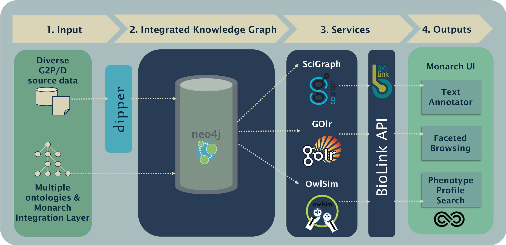

  <h2 class="page-title">Monarch Web Services</h2>
  

    

      
    

    

      <h5><strong>Architecture</strong></h5>
      

        Structured and unstructured data sources are loaded into SciGraph via
        dipper (1) , our data ingest pipeline. A variety of ontologies are
        processed in the Monarch Integration Layer and are also loaded into
        SciGraph, resulting in a combined knowledge and data graph (2). Data is
        disseminated via SciGraph Services, wrapped around by the BioLink API
        (3). This lightweight API makes few assumptions, acting as a data access
        layer for all of Monarch’s Services. Users can interrogate Monarch using
        our tools for text annotation, navigating the ontologies, and matching
        phenotype profiles (4).
      

    

  

  

    

      

          
        <b-button
          href="https://api-biolink.monarchinitiative.org/api/"
          target="_blank"
          class="documentation"
          variant="outline-light"
          >Documentation</b-button
        >
      

      

        

          An API providing access to biologically and biomedically relevant
          entities, and the relationships between them.
        

        
          <ul>
            <li>genes, gene products, proteins</li>
            <li>diseases, phenotypes, traits, and clinical measurements</li>
            <li>pathways, biological process</li>
            <li>substances: small molecules, drugs, chemical entities</li>
            <li>biological and molecular roles and activities</li>
            <li>
              genotypes, alleles, sequence variants; for plants, germplasms
            </li>
          </ul>
        
        
          <ul>
            <li>environmental contexts and exposures</li>
            <li>individual organisms: patients, cohorts, model organisms</li>
            <li>cell lines and cell types</li>
            <li>
              investigations: experiments, clinical trials, and 'natural
              experiments'
            </li>
            <li>genomic features, phylogenies</li>
            <li>publications, ontology terms, database metadata</li>
          </ul>
        
      

    

  

